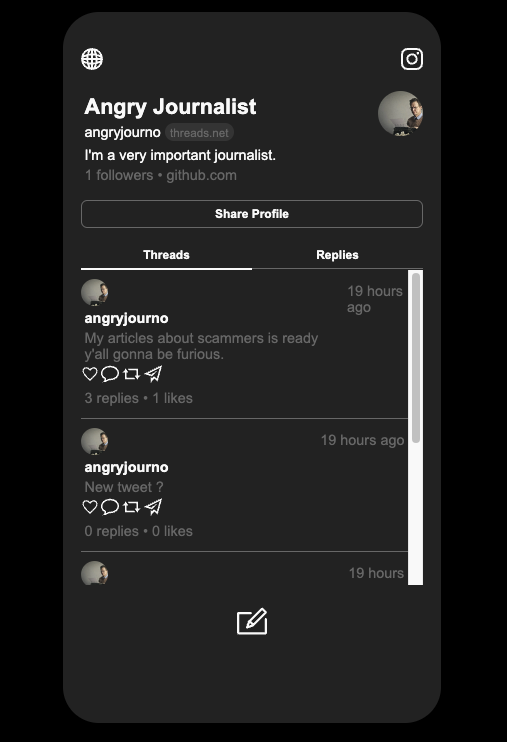

JSON server
npm install json-server
json-server --watch db.json

VITE
npm create vite@latest

Reste à faire :

- problème affichage date récente sur nouveau tweet
- remplacer icone coeur par coeur plein quand like et faire perdurer
- pouvoir cliquer sur le profil de la personne qui répond

